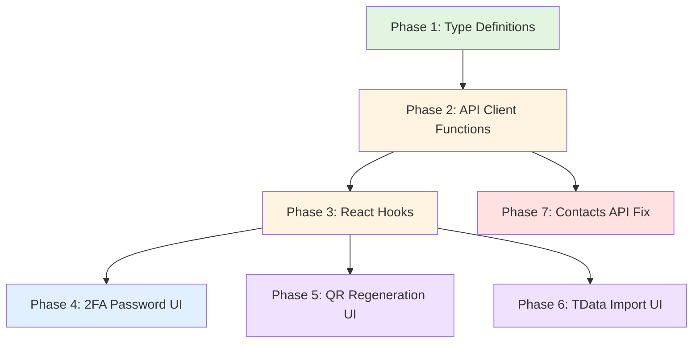

# Frontend API Features Fix Plan

## Executive Summary

This plan outlines the changes needed to implement missing API features in the Telegram API frontend. The backend provides a comprehensive REST API with endpoints for session management (SMS, QR, TData import), 2FA password submission, QR code regeneration, and contacts management with pagination. The frontend is missing several key features:

1. **2FA Password Submission** - No UI or API integration for submitting 2FA passwords
2. **QR Code Regeneration** - No API integration for regenerating expired QR codes
3. **TData Import** - No UI or API integration for importing Telegram Desktop sessions
4. **Auth Method Type Definition** - Missing `'tdata'` in the AuthMethod type
5. **Contacts API Query Parameters** - Frontend sends unsupported `search` parameter

The implementation will require updates to type definitions, API clients, React hooks, and UI components across the frontend codebase.

---

## Detailed Changes by Category

### 1. Sessions API - Missing Endpoints

#### 1.1 Submit 2FA Password

**API Endpoint:** `POST /sessions/{id}/submit-password`

**Current State:** Not implemented

**Required Changes:**
- Add API function in [`sessions.api.ts`](../frontend/src/api/sessions.api.ts)
- Add type definition for `SubmitPasswordRequest`
- Add React hook `useSubmitPassword` in [`useSessions.ts`](../frontend/src/hooks/useSessions.ts)
- Create new component `SubmitPasswordModal` in [`components/sessions/`](../frontend/src/components/sessions/)
- Update [`DashboardPage.tsx`](../frontend/src/pages/dashboard/DashboardPage.tsx) to handle 2FA flow
- Update [`VerifySMSModal.tsx`](../frontend/src/components/sessions/VerifySMSModal.tsx) to handle 2FA requirement after SMS verification

**Request/Response:**
```typescript
// Request
interface SubmitPasswordRequest {
  password: string
}

// Response
interface TelegramSession {
  // ... existing fields
  hint?: string // Password hint when password_required
}
```

#### 1.2 Regenerate QR Code

**API Endpoint:** `POST /sessions/{id}/qr/regenerate`

**Current State:** Not implemented

**Required Changes:**
- Add API function in [`sessions.api.ts`](../frontend/src/api/sessions.api.ts)
- Add React hook `useRegenerateQR` in [`useSessions.ts`](../frontend/src/hooks/useSessions.ts)
- Update [`QRCodeModal.tsx`](../frontend/src/components/sessions/QRCodeModal.tsx) to support QR regeneration

**Request/Response:**
```typescript
// Response
interface RegenerateQRResponse {
  session_id: string
  qr_image_base64: string
  message: string
}
```

#### 1.3 Import TData Session

**API Endpoint:** `POST /sessions/import-tdata`

**Current State:** Not implemented

**Required Changes:**
- Add API function in [`sessions.api.ts`](../frontend/src/api/sessions.api.ts) (multipart/form-data)
- Add type definition for `ImportTDataRequest`
- Add React hook `useImportTData` in [`useSessions.ts`](../frontend/src/hooks/useSessions.ts)
- Create new component `ImportTDataModal` in [`components/sessions/`](../frontend/src/components/sessions/)
- Update [`CreateSessionModal.tsx`](../frontend/src/components/sessions/CreateSessionModal.tsx) to add TData option
- Update [`DashboardPage.tsx`](../frontend/src/pages/dashboard/DashboardPage.tsx) to handle TData import flow

**Request/Response:**
```typescript
// Request (multipart/form-data)
interface ImportTDataRequest {
  api_id: number
  api_hash: string
  session_name?: string
  tdata: File[] // Multiple files
}

// Response
interface ImportTDataResponse {
  session: {
    session_id: string
    is_active: boolean
    telegram_user_id?: number
    username?: string
    auth_state: string
    auth_method: 'tdata'
  }
}
```

### 2. Type Definitions

#### 2.1 AuthMethod Type

**File:** [`session.types.ts`](../frontend/src/types/session.types.ts)

**Current State:**
```typescript
auth_method?: 'sms' | 'qr'
```

**Required Change:**
```typescript
export type AuthMethod = 'sms' | 'qr' | 'tdata'

export interface CreateSessionRequest {
  phone?: string
  api_id: number
  api_hash: string
  session_name: string
  auth_method?: AuthMethod
}
```

#### 2.2 New Type Definitions

**File:** [`session.types.ts`](../frontend/src/types/session.types.ts)

**Add:**
```typescript
export interface SubmitPasswordRequest {
  password: string
}

export interface ImportTDataRequest {
  api_id: number
  api_hash: string
  session_name?: string
  tdata: File[]
}

export interface ImportTDataResponse {
  session: {
    session_id: string
    is_active: boolean
    telegram_user_id?: number
    username?: string
    auth_state: string
    auth_method: 'tdata'
  }
}

export interface RegenerateQRResponse {
  session_id: string
  qr_image_base64: string
  message: string
}

// Update CreateSessionResponse to include hint
export interface CreateSessionResponse {
  session: TelegramSession
  phone_code_hash?: string
  qr_image_base64?: string
  hint?: string // 2FA password hint
  message?: string
  next_step?: string
}
```

### 3. Contacts API Query Parameters

**API Endpoint:** `GET /sessions/{id}/contacts`

**Current State:**
- Frontend sends `limit`, `offset`, `search` query parameters
- Backend supports `limit`, `offset`, `refresh` (but NOT `search`)
- Swagger documentation shows no query parameters (incomplete documentation)

**Required Changes:**
- Update [`chats.api.ts`](../frontend/src/api/chats.api.ts) to remove unsupported `search` parameter
- Update [`useChats.ts`](../frontend/src/hooks/useChats.ts) to remove `search` from types
- Consider adding `refresh` parameter support for cache invalidation

**Backend Support (Verified):**
```go
// From internal/handler/chat_handler_contacts.go
req := domain.GetContactsRequest{
    Limit:   c.QueryInt("limit", 50),
    Offset:  c.QueryInt("offset", 0),
    Refresh: c.QueryBool("refresh", false),
}
```

**Frontend Change Required:**
```typescript
// Remove search from GetContactsParams
export interface GetContactsParams {
  limit?: number
  offset?: number
  refresh?: boolean  // Add this for cache refresh
}
```

---

## Implementation Plan

### Phase 1: Foundation Changes (Type Definitions)

**Priority:** High - Must be completed first as other changes depend on these types

**Files to Modify:**
1. [`frontend/src/types/session.types.ts`](../frontend/src/types/session.types.ts)
   - Add `AuthMethod` type with `'sms' | 'qr' | 'tdata'`
   - Add `SubmitPasswordRequest` interface
   - Add `ImportTDataRequest` interface
   - Add `ImportTDataResponse` interface
   - Add `RegenerateQRResponse` interface
   - Update `CreateSessionResponse` to include optional `hint` field

**Dependencies:** None

---

### Phase 2: API Client Functions

**Priority:** High - Required before implementing hooks and components

**Files to Modify:**
1. [`frontend/src/api/sessions.api.ts`](../frontend/src/api/sessions.api.ts)
   - Add `submitPassword()` function
   - Add `regenerateQR()` function
   - Add `importTData()` function (multipart/form-data)

2. [`frontend/src/api/chats.api.ts`](../frontend/src/api/chats.api.ts)
   - Update `GetContactsParams` interface (remove `search`, add `refresh`)
   - Update `getContacts()` function to use correct parameters

**Dependencies:** Phase 1 (Type Definitions)

---

### Phase 3: React Hooks

**Priority:** High - Required before implementing UI components

**Files to Modify:**
1. [`frontend/src/hooks/useSessions.ts`](../frontend/src/hooks/useSessions.ts)
   - Add `useSubmitPassword()` hook
   - Add `useRegenerateQR()` hook
   - Add `useImportTData()` hook

2. [`frontend/src/hooks/useChats.ts`](../frontend/src/hooks/useChats.ts)
   - Update `useContacts()` and `useInfiniteContacts()` to remove `search` parameter
   - Add `refresh` parameter support

**Dependencies:** Phase 2 (API Client Functions)

---

### Phase 4: UI Components - 2FA Password

**Priority:** High - Critical for accounts with 2FA enabled

**Files to Modify/Create:**
1. **Create:** [`frontend/src/components/sessions/SubmitPasswordModal.tsx`](../frontend/src/components/sessions/SubmitPasswordModal.tsx)
   - Modal for submitting 2FA password
   - Display password hint if available
   - Handle validation and error states
   - Show loading state during submission

2. **Update:** [`frontend/src/components/sessions/VerifySMSModal.tsx`](../frontend/src/components/sessions/VerifySMSModal.tsx)
   - Update `onSuccess` callback to handle 2FA requirement
   - Return hint from verification response if password is required

3. **Update:** [`frontend/src/pages/dashboard/DashboardPage.tsx`](../frontend/src/pages/dashboard/DashboardPage.tsx)
   - Add state for showing 2FA modal
   - Handle 2FA flow after SMS verification
   - Pass hint to SubmitPasswordModal

**Dependencies:** Phase 3 (React Hooks)

---

### Phase 5: UI Components - QR Code Regeneration

**Priority:** Medium - Improves user experience for QR authentication

**Files to Modify:**
1. **Update:** [`frontend/src/components/sessions/QRCodeModal.tsx`](../frontend/src/components/sessions/QRCodeModal.tsx)
   - Add "Regenerate QR" button
   - Implement regeneration logic with attempt counter
   - Update QR image on successful regeneration
   - Show loading state during regeneration
   - Handle regeneration errors

**Dependencies:** Phase 3 (React Hooks)

---

### Phase 6: UI Components - TData Import

**Priority:** Medium - Enables alternative authentication method

**Files to Modify/Create:**
1. **Create:** [`frontend/src/components/sessions/ImportTDataModal.tsx`](../frontend/src/components/sessions/ImportTDataModal.tsx)
   - Form for API credentials (API ID, API Hash)
   - File upload for TData files (drag & drop support)
   - Progress indicator for upload
   - Error handling for invalid TData files
   - Success state after import

2. **Update:** [`frontend/src/components/sessions/CreateSessionModal.tsx`](../frontend/src/components/sessions/CreateSessionModal.tsx)
   - Add TData as third authentication method option
   - Add button to open ImportTDataModal

3. **Update:** [`frontend/src/pages/dashboard/DashboardPage.tsx`](../frontend/src/pages/dashboard/DashboardPage.tsx)
   - Add state for showing TData import modal
   - Handle TData import success

**Dependencies:** Phase 3 (React Hooks)

---

### Phase 7: Contacts API Fix

**Priority:** Low - Minor cleanup, no user-facing impact

**Files to Modify:**
1. [`frontend/src/api/chats.api.ts`](../frontend/src/api/chats.api.ts)
   - Remove `search` from `GetContactsParams`
   - Add `refresh` to `GetContactsParams`

2. [`frontend/src/hooks/useChats.ts`](../frontend/src/hooks/useChats.ts)
   - Update hooks to use correct parameters

**Dependencies:** Phase 2 (API Client Functions)

---

## Technical Specifications

### Type Definitions

#### File: `frontend/src/types/session.types.ts`

```typescript
// Add AuthMethod type
export type AuthMethod = 'sms' | 'qr' | 'tdata'

// Update CreateSessionRequest
export interface CreateSessionRequest {
  phone?: string
  api_id: number
  api_hash: string
  session_name: string
  auth_method?: AuthMethod
}

// Update CreateSessionResponse
export interface CreateSessionResponse {
  session: TelegramSession
  phone_code_hash?: string
  qr_image_base64?: string
  hint?: string  // 2FA password hint
  message?: string
  next_step?: string
}

// Add new interfaces
export interface SubmitPasswordRequest {
  password: string
}

export interface ImportTDataRequest {
  api_id: number
  api_hash: string
  session_name?: string
  tdata: File[]
}

export interface ImportTDataResponse {
  session: {
    session_id: string
    is_active: boolean
    telegram_user_id?: number
    username?: string
    auth_state: string
    auth_method: 'tdata'
  }
}

export interface RegenerateQRResponse {
  session_id: string
  qr_image_base64: string
  message: string
}
```

#### File: `frontend/src/api/chats.api.ts`

```typescript
// Update GetContactsParams
export interface GetContactsParams {
  limit?: number
  offset?: number
  refresh?: boolean  // For cache refresh
}
```

---

### API Functions

#### File: `frontend/src/api/sessions.api.ts`

```typescript
import { apiClient } from './client'
import {
  TelegramSession,
  CreateSessionRequest,
  CreateSessionResponse,
  VerifyCodeRequest,
  SubmitPasswordRequest,
  ImportTDataRequest,
  ImportTDataResponse,
  RegenerateQRResponse,
  SessionStatus,
} from '@/types'

export const sessionsApi = {
  // ... existing functions ...

  submitPassword: async (
    sessionId: string,
    data: SubmitPasswordRequest
  ): Promise<TelegramSession> => {
    return apiClient.post<TelegramSession>(
      `/sessions/${sessionId}/submit-password`,
      data
    )
  },

  regenerateQR: async (sessionId: string): Promise<RegenerateQRResponse> => {
    return apiClient.post<RegenerateQRResponse>(
      `/sessions/${sessionId}/qr/regenerate`
    )
  },

  importTData: async (
    data: ImportTDataRequest
  ): Promise<ImportTDataResponse> => {
    const formData = new FormData()
    formData.append('api_id', data.api_id.toString())
    formData.append('api_hash', data.api_hash)
    if (data.session_name) {
      formData.append('session_name', data.session_name)
    }
    data.tdata.forEach((file) => {
      formData.append('tdata', file)
    })

    return apiClient.post<ImportTDataResponse>(
      '/sessions/import-tdata',
      formData,
      {
        headers: {
          'Content-Type': 'multipart/form-data',
        },
      }
    )
  },
}
```

---

### React Hooks

#### File: `frontend/src/hooks/useSessions.ts`

```typescript
import { useQuery, useMutation, useQueryClient } from '@tanstack/react-query'
import { sessionsApi } from '@/api'
import type {
  CreateSessionRequest,
  SubmitPasswordRequest,
  ImportTDataRequest,
} from '@/types'

export const SESSIONS_QUERY_KEY = 'sessions'

// ... existing hooks ...

export const useSubmitPassword = () => {
  const queryClient = useQueryClient()

  return useMutation({
    mutationFn: ({ sessionId, password }: { sessionId: string; password: string }) =>
      sessionsApi.submitPassword(sessionId, { password }),
    onSuccess: () => {
      queryClient.invalidateQueries({ queryKey: [SESSIONS_QUERY_KEY] })
    },
  })
}

export const useRegenerateQR = () => {
  return useMutation({
    mutationFn: (sessionId: string) => sessionsApi.regenerateQR(sessionId),
  })
}

export const useImportTData = () => {
  const queryClient = useQueryClient()

  return useMutation({
    mutationFn: (data: ImportTDataRequest) => sessionsApi.importTData(data),
    onSuccess: () => {
      queryClient.invalidateQueries({ queryKey: [SESSIONS_QUERY_KEY] })
    },
  })
}
```

---

### Component Specifications

#### Component: SubmitPasswordModal

**File:** `frontend/src/components/sessions/SubmitPasswordModal.tsx`

**Props:**
```typescript
interface SubmitPasswordModalProps {
  isOpen: boolean
  onClose: () => void
  sessionId: string
  hint?: string  // Password hint from backend
  onSuccess: () => void
}
```

**Features:**
- Password input field (masked)
- Display hint if available
- Submit button with loading state
- Cancel button
- Error message display
- Close on success

**UI Flow:**
1. User sees modal with password input
2. If hint is available, display it
3. User enters password and submits
4. Show loading state
5. On success, close modal and refresh sessions
6. On error, display error message

---

#### Component: ImportTDataModal

**File:** `frontend/src/components/sessions/ImportTDataModal.tsx`

**Props:**
```typescript
interface ImportTDataModalProps {
  isOpen: boolean
  onClose: () => void
  onSuccess: (sessionId: string) => void
}
```

**Features:**
- API ID input (number)
- API Hash input (text)
- Session name input (optional)
- File upload area for TData files (drag & drop)
- List of uploaded files with remove option
- Progress indicator during upload
- Submit button with loading state
- Cancel button
- Error message display

**UI Flow:**
1. User opens modal
2. User enters API credentials
3. User uploads TData files (one or multiple)
4. User submits form
5. Show loading state with progress
6. On success, close modal and notify parent
7. On error, display error message

---

#### Component Updates

**QRCodeModal.tsx Updates:**
- Add "Regenerate QR" button
- Implement `useRegenerateQR` hook
- Track regeneration attempts (max 3)
- Update QR image on successful regeneration
- Show loading state during regeneration
- Disable regeneration after max attempts

**VerifySMSModal.tsx Updates:**
- Update `onSuccess` callback signature to include hint
- Pass hint back to parent component
- Handle case where 2FA is required after SMS verification

**CreateSessionModal.tsx Updates:**
- Add TData option to auth method selection
- Add button to open ImportTDataModal when TData is selected
- Update AuthMethod type usage

**DashboardPage.tsx Updates:**
- Add state for SubmitPasswordModal
- Add state for ImportTDataModal
- Handle 2FA flow after SMS verification
- Handle TData import success
- Pass hint to SubmitPasswordModal

---

## Testing Considerations

### Unit Tests

**Type Definitions:**
- Verify AuthMethod includes all three values
- Verify SubmitPasswordRequest structure
- Verify ImportTDataRequest structure
- Verify RegenerateQRResponse structure

**API Functions:**
- Test submitPassword with valid/invalid data
- Test regenerateQR with valid session ID
- Test importTData with valid/invalid files
- Test FormData construction for TData import

**React Hooks:**
- Test useSubmitPassword mutation
- Test useRegenerateQR mutation
- Test useImportTData mutation
- Verify query invalidation on success

### Integration Tests

**2FA Flow:**
1. Create session with SMS auth
2. Submit SMS code
3. Verify 2FA is required (hint returned)
4. Submit 2FA password
5. Verify session becomes active

**QR Regeneration Flow:**
1. Create session with QR auth
2. Wait for QR to expire
3. Regenerate QR code
4. Verify new QR image is displayed
5. Scan new QR successfully

**TData Import Flow:**
1. Open ImportTDataModal
2. Enter valid API credentials
3. Upload valid TData files
4. Submit form
5. Verify session is created and active

**Contacts API:**
1. Call getContacts with limit and offset
2. Verify correct pagination
3. Call getContacts with refresh=true
4. Verify cache is refreshed

### Edge Cases

**2FA Password:**
- Wrong password submitted
- Empty password submitted
- Session already authenticated
- Session not found
- Network errors during submission

**QR Regeneration:**
- Regenerate before expiration
- Regenerate after max attempts
- Session not found
- Network errors during regeneration

**TData Import:**
- Invalid API credentials
- Corrupt TData files
- Missing required TData files
- File upload errors
- Large file uploads
- Network errors during upload

**Contacts API:**
- Invalid limit values (negative, too large)
- Invalid offset values
- Empty contacts list
- Network errors

### UI/UX Considerations

**Accessibility:**
- All modals should be keyboard accessible
- Form inputs should have proper labels
- Error messages should be screen reader friendly
- Loading states should be announced

**User Experience:**
- Clear error messages with actionable guidance
- Loading states for all async operations
- Progress indicators for file uploads
- Visual feedback for success/failure
- Confirmation before destructive actions

**Responsive Design:**
- Modals should work on mobile devices
- File upload area should support touch
- Forms should be usable on small screens

**Performance:**
- Debounce file upload inputs
- Optimize large file uploads
- Cache QR images appropriately
- Lazy load modal components

---

## Implementation Order Summary



### Critical Path

The critical path for implementing the most important feature (2FA password support):

1. **Phase 1:** Type definitions (SubmitPasswordRequest, hint in CreateSessionResponse)
2. **Phase 2:** submitPassword API function
3. **Phase 3:** useSubmitPassword hook
4. **Phase 4:** SubmitPasswordModal component and integration

This enables users with 2FA-enabled accounts to complete authentication.

### Parallel Work

After Phase 3, the following can be implemented in parallel:
- QR Regeneration UI (Phase 5)
- TData Import UI (Phase 6)
- Contacts API Fix (Phase 7)

---

## Dependencies

### External Dependencies
- `@tanstack/react-query` - Already in use for data fetching
- `lucide-react` - Already in use for icons
- No new dependencies required

### Internal Dependencies
- All changes depend on existing infrastructure (API client, hooks, components)
- No changes to backend required
- No changes to build configuration required

---

## Risk Assessment

| Risk | Impact | Likelihood | Mitigation |
|------|--------|------------|------------|
| 2FA flow breaks existing SMS flow | High | Low | Thorough testing, backward compatibility |
| TData file upload fails on large files | Medium | Medium | Add file size validation, progress indicators |
| QR regeneration causes infinite loop | Low | Low | Add attempt counter, max attempts limit |
| Contacts API change breaks existing pages | Low | Low | Verify all usages before removing `search` |

---

## Success Criteria

- [ ] All missing API endpoints are implemented in the frontend
- [ ] 2FA password submission works end-to-end
- [ ] QR code regeneration works end-to-end
- [ ] TData import works end-to-end
- [ ] Contacts API uses correct query parameters
- [ ] All type definitions are accurate and complete
- [ ] All components are accessible and responsive
- [ ] Error handling is comprehensive
- [ ] Loading states are properly implemented
- [ ] No existing functionality is broken

---

## Notes

1. **Backend Verification:** All endpoints have been verified to exist in the backend implementation through analysis of handler files and Swagger documentation.

2. **Contacts API Discrepancy:** The Swagger documentation shows no query parameters for contacts, but the backend handler actually supports `limit`, `offset`, and `refresh`. The frontend should align with the backend implementation.

3. **TData File Upload:** The backend expects multiple files to be uploaded with the form field name `tdata`. The frontend must use FormData with proper file handling.

4. **2FA Hint:** The backend returns a `hint` field in the CreateSessionResponse when 2FA is required. This should be displayed to the user to help them remember their password.

5. **QR Expiration:** The QR code expires after 2 minutes and can be regenerated up to 3 times. The frontend should track attempts and provide appropriate feedback.

6. **Session States:** The frontend should handle all session states defined in the backend: `pending`, `code_sent`, `password_required`, `authenticated`, `failed`, `banned`, `frozen`.
